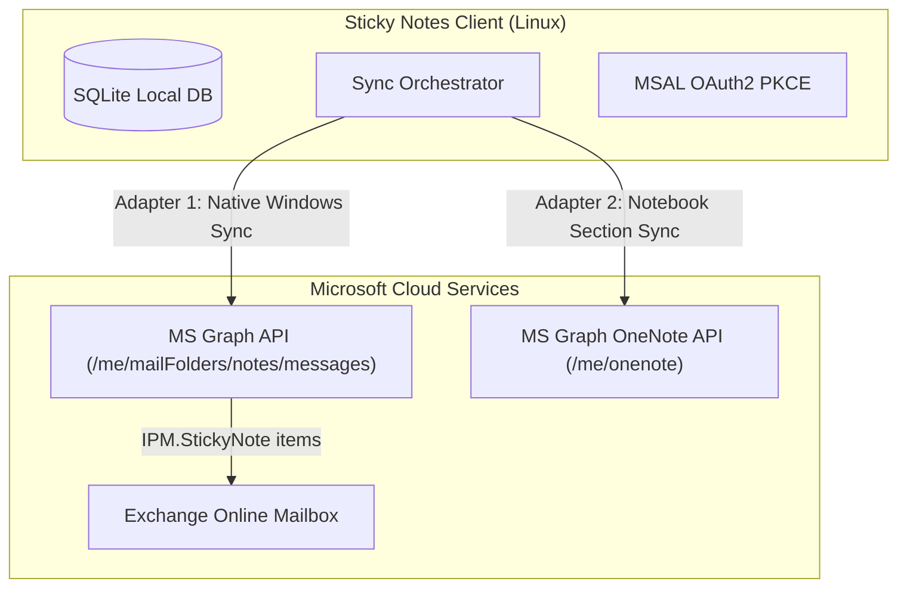
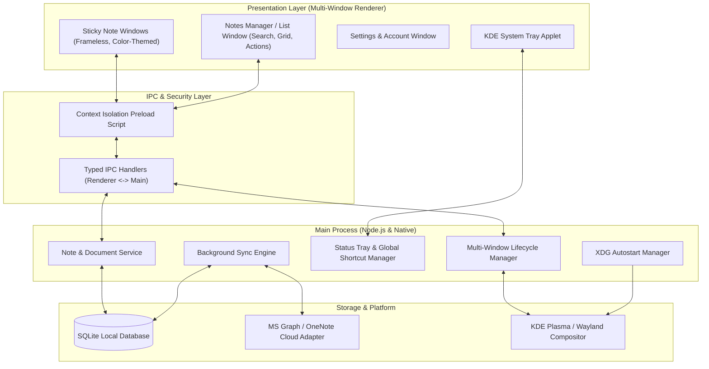
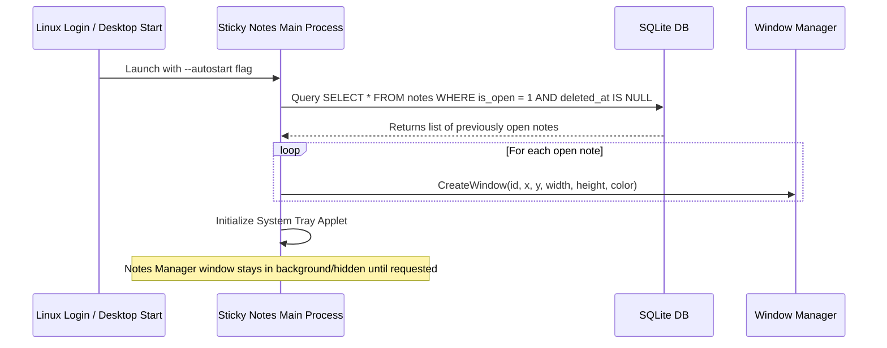

# Windows Sticky Notes for Linux: Architecture & Design Specification

## 1. Executive Summary & Target Environment

This specification defines the software architecture for **Sticky Notes for Linux**, an open-source, pixel-faithful desktop application designed to recreate the Windows Sticky Notes experience on Linux.

### System Compatibility Analysis
* **Host Operating System:** Parrot Security 7.3 (Debian 13.5 `trixie` base, Linux Kernel 7.0.9 amd64)
* **Desktop Environment:** KDE Plasma 6 (`XDG_CURRENT_DESKTOP=KDE`, `DESKTOP_SESSION=plasma`)
* **Display Protocol:** Wayland (`XDG_SESSION_TYPE=wayland`)
* **Graphics Hardware:** AMD Radeon RX 7600 (Navi 33) & AMD Granite Ridge RDNA3 (Mesa / AMDGPU driver with full Wayland hardware acceleration)
* **Available Toolchains:** Node.js v20.19, Python 3.13.5, Rust/Cargo 1.94, GCC 14, Qt6/GTK4 libraries.

---

## 2. Microsoft OneNote & Sticky Notes Sync: Upfront Feasibility Analysis

> [!IMPORTANT]
> **Microsoft Sync Realities & Strategy:**
> Microsoft does **not** have a dedicated public `stickyNotes` endpoint in Microsoft Graph. However, cloud synchronization is **100% architecturally feasible** via two distinct integration pathways.



### Pathway A: Native Windows Sticky Notes Sync (Exchange Mailbox API)
* **Mechanism:** Official Windows Sticky Notes syncs to the user's Microsoft 365 / Outlook mailbox under the `IPF.StickyNote` folder with message class `IPM.StickyNote`.
* **Graph Endpoint:** `https://graph.microsoft.com/v1.0/me/mailFolders/notes/messages` or filtered message queries.
* **Compatibility:** Allows seamless bi-directional sync with the Windows Sticky Notes app, OneNote Mobile Feed, and Outlook Web Sticky Notes.
* **Requirements:** OAuth2 scopes `Mail.ReadWrite`, `offline_access`.

### Pathway B: OneNote Dedicated Section Sync
* **Mechanism:** Notes are synchronized as pages within a dedicated notebook section (e.g. `Sticky Notes / Quick Notes`).
* **Graph Endpoint:** `https://graph.microsoft.com/v1.0/me/onenote/sections/{id}/pages`.
* **Compatibility:** Allows notes to appear directly in OneNote notebooks across Mac, iOS, Android, and Web.
* **Requirements:** OAuth2 scopes `Notes.ReadWrite`, `offline_access`.

### Architecture Provision:
We use a **Provider Sync Abstraction (Adapter Pattern)**. The local SQLite database is the single source of truth for the UI; the `SyncEngine` operates in the background, making MVP offline-first and instantly usable without Microsoft login, while ready to plug in the Microsoft Sync Adapter.

---

## 3. High-Level System Architecture

We adopt an **Electron + TypeScript + React/Vite + SQLite (`better-sqlite3`)** architecture.



### Why This Stack Excels for KDE Plasma & Wayland:
1. **Multi-Window Native IPC:** Windows Sticky Notes requires N independent floating note windows plus a central Manager window. Electron's `BrowserWindow` orchestration provides robust individual window management, per-note geometry tracking, and custom frameless drag regions.
2. **Wayland Support:** Full hardware acceleration with native Wayland window flags (`--ozone-platform=wayland` or auto-detection).
3. **Exact Visual Fidelity:** Full control over typography, Windows 10/11 Fluent Design palette, subtle elevation shadows, inline formatting toolbar, and responsive note cards.
4. **Offline-First High-Performance Storage:** Synchronous atomic transactions with SQLite via `better-sqlite3`.

---

## 4. Database Schema (SQLite)

The local SQLite database resides in standard XDG path: `~/.local/share/sticky-notes/stickynotes.db`.

```sql
-- Notes Table
CREATE TABLE IF NOT EXISTS notes (
    id TEXT PRIMARY KEY,                       -- UUID v4
    title TEXT,                                -- Auto-derived or first line
    content_html TEXT NOT NULL DEFAULT '',     -- Rich text HTML representation
    content_plain TEXT NOT NULL DEFAULT '',    -- Plaintext for instant full-text search
    color TEXT NOT NULL DEFAULT 'yellow',      -- 'yellow' | 'green' | 'pink' | 'purple' | 'blue' | 'charcoal' | 'white'
    is_open INTEGER NOT NULL DEFAULT 1,        -- 1 = Window is open on desktop, 0 = Closed/In Manager
    is_pinned INTEGER NOT NULL DEFAULT 0,      -- Always-on-top flag (1 = Top, 0 = Normal)
    pos_x INTEGER,                             -- Last X coordinate on desktop
    pos_y INTEGER,                             -- Last Y coordinate on desktop
    width INTEGER NOT NULL DEFAULT 300,        -- Window width in px (min 220)
    height INTEGER NOT NULL DEFAULT 320,       -- Window height in px (min 200)
    z_order INTEGER DEFAULT 0,                 -- Layer ordering
    created_at INTEGER NOT NULL,               -- Unix timestamp (ms)
    updated_at INTEGER NOT NULL,               -- Unix timestamp (ms)
    deleted_at INTEGER DEFAULT NULL,           -- Soft delete timestamp (ms)
    
    -- Sync Metadata Columns (For Phase 2 MS Cloud Integration)
    remote_id TEXT DEFAULT NULL,               -- Microsoft Graph Message ID / OneNote Page ID
    sync_status TEXT DEFAULT 'synced',         -- 'synced' | 'pending_create' | 'pending_update' | 'pending_delete'
    change_key TEXT DEFAULT NULL,              -- ETag / ChangeKey for conflict resolution
    last_synced_at INTEGER DEFAULT NULL
);

-- Full-Text Search (FTS5) for instant search in Notes Manager
CREATE VIRTUAL TABLE IF NOT EXISTS notes_fts USING fts5(
    id UNINDEXED,
    content_plain,
    content='notes',
    content_rowid='rowid'
);

-- Triggers for maintaining FTS index
CREATE TRIGGER IF NOT EXISTS notes_ai AFTER INSERT ON notes BEGIN
    INSERT INTO notes_fts(rowid, id, content_plain) VALUES (new.rowid, new.id, new.content_plain);
END;
CREATE TRIGGER IF NOT EXISTS notes_ad AFTER DELETE ON notes BEGIN
    INSERT INTO notes_fts(notes_fts, rowid, id, content_plain) VALUES('delete', old.rowid, old.id, old.content_plain);
END;
CREATE TRIGGER IF NOT EXISTS notes_au AFTER UPDATE ON notes BEGIN
    INSERT INTO notes_fts(notes_fts, rowid, id, content_plain) VALUES('delete', old.rowid, old.id, old.content_plain);
    INSERT INTO notes_fts(rowid, id, content_plain) VALUES (new.rowid, new.id, new.content_plain);
END;

-- App Settings Key-Value Store
CREATE TABLE IF NOT EXISTS settings (
    key TEXT PRIMARY KEY,
    value TEXT NOT NULL
);
```

---

## 5. UI/UX Specifications (Windows Sticky Notes Faithful Design)

### 5.1 Color Palette & Theme Tokens

| Color Name | Light Mode Header | Light Mode Body | Dark Mode Header | Dark Mode Body | Accent Circle |
| :--- | :--- | :--- | :--- | :--- | :--- |
| **Yellow** *(Default)* | `#FFF176` | `#FFF9C4` | `#3A341C` | `#2D2816` | `#FDD835` |
| **Green** | `#C8E6C9` | `#E8F5E9` | `#1E3622` | `#172A1B` | `#81C784` |
| **Pink** | `#F8BBD0` | `#FCE4EC` | `#3D1F2D` | `#2E1722` | `#F06292` |
| **Purple** | `#E1BEE7` | `#F3E5F5` | `#331E3D` | `#26162E` | `#BA68C8` |
| **Blue** | `#B3E5FC` | `#E1F5FE` | `#1C2E3D` | `#162430` | `#4FC3F7` |
| **Charcoal** | `#374151` | `#1F2937` | `#27272A` | `#18181B` | `#4B5563` |
| **White/Grey** | `#F3F4F6` | `#FFFFFF` | `#3F3F46` | `#27272A` | `#E5E7EB` |

### 5.2 Sticky Note Window Structure
* **Frameless Window with Native Drag Region:** `-webkit-app-region: drag` for header.
* **Top Header Actions:**
  * `+` Button (Top Left): Spawns a new sticky note next to the current one.
  * `...` Menu (Top Right): Opens color selector popover, "Notes list" navigation button, and "Delete note" action.
  * `✕` Close Button (Top Right): Hides/closes window (`is_open = 0`), preserves note in database.
* **Content Editor:**
  * Rich-text content area supporting Bold (`Ctrl+B`), Italic (`Ctrl+I`), Underline (`Ctrl+U`), Strikethrough (`Ctrl+T`), Bullet lists (`Ctrl+Shift+L`), and Checklists.
  * Debounced autosave (300ms) directly to SQLite.
* **Bottom Toolbar:**
  * Windows-style formatting icons: `B`, `I`, `U`, `S`, `List`, `Checklist`, `Image`.
  * Toggleable via keyboard shortcut or ellipses menu.

### 5.3 Notes Manager Window Structure
* **Top Bar:** Search input with live debounced search across note titles/body content, `+` New Note button, Settings gear icon.
* **List / Grid View:** Masonry or 2-column card view showcasing:
  * Color-coded card matching the note's color.
  * Text snippet and formatted preview.
  * Formatted date/time stamp (e.g. "Today at 2:15 PM").
  * Status indicator (Open on Desktop vs. Closed).
* **Actions:**
  * Single/double click card: Instantly opens/focuses the corresponding sticky note window on the desktop.
  * Right-click / Ellipses context menu: "Open note", "Change color", "Delete note" (with Windows-style confirm modal: *"Are you sure you want to delete this note?"*).

---

## 6. Autostart & State Restoration (Parrot OS / Linux)

### 6.1 XDG Desktop Autostart Specification
When enabled (default on install), the app creates an XDG autostart entry at `~/.config/autostart/sticky-notes.desktop`:

```ini
[Desktop Entry]
Type=Application
Exec=sticky-notes --autostart
Hidden=false
NoDisplay=false
X-GNOME-Autostart-enabled=true
Name=Sticky Notes
Comment=Windows-style Sticky Notes for Linux
Icon=sticky-notes
Categories=Utility;TextEditor;
StartupNotify=false
```

### 6.2 Startup Flow


---

## 7. IPC Channel Definitions

| IPC Channel | Type | Payload | Description |
| :--- | :--- | :--- | :--- |
| `notes:getAll` | `invoke` | `{ search?: string, includeClosed?: boolean }` | Fetch notes for Notes Manager |
| `notes:getById` | `invoke` | `id: string` | Fetch single note data |
| `notes:create` | `invoke` | `{ color?: string, x?: number, y?: number }` | Create new note & open window |
| `notes:update` | `invoke` | `{ id: string, content_html?: string, color?: string, ... }` | Update note data |
| `notes:closeWindow` | `invoke` | `id: string` | Close note window & set `is_open = 0` |
| `notes:openWindow` | `invoke` | `id: string` | Open/focus note window & set `is_open = 1` |
| `notes:delete` | `invoke` | `id: string` | Soft/hard delete note & destroy window |
| `notes:updateBounds`| `send` | `{ id: string, x: number, y: number, width: number, height: number }`| Save note position & size |
| `manager:toggle` | `invoke` | `void` | Show/hide the central Notes Manager window |
| `settings:get` | `invoke` | `key: string` | Retrieve app configuration |
| `settings:set` | `invoke` | `{ key: string, value: string }` | Update app configuration |
