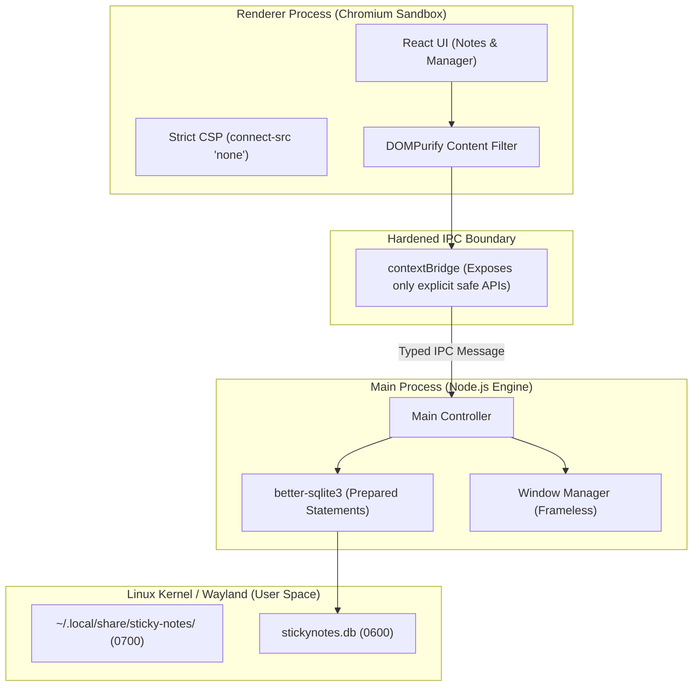

# Security Review & Threat Model: Sticky Notes for Linux

**Target Environment:** Parrot Security OS 7.3 (KDE Plasma 6 / Wayland)  
**Security Posture:** 100% Local-Only, User-Space Execution, Zero Network Attack Surface

---

## 1. Executive Security Assessment

| Security Dimension | Status | Implementation Details |
| :--- | :--- | :--- |
| **Privilege Level** | ✅ **User-Space Only** | Operates strictly under standard UID; zero `root`/`sudo` requirements. |
| **Network Exposure** | ✅ **Air-Gapped / Zero Ports** | No internal HTTP/WS servers; memory-based IPC; strict `connect-src 'none'` CSP. |
| **Supply Chain** | ✅ **Vetted & Minimalist** | Lean dependency tree; locked hashes; zero unverified binaries. |
| **Process Isolation** | ✅ **Multi-Layer Sandbox** | `contextIsolation: true`, `nodeIntegration: false`, Chromium Renderer Sandbox. |
| **Data At Rest** | ✅ **POSIX File Perms (0600)** | SQLite file and config restricted exclusively to user (`chmod 0600 / 0700`). |
| **Input & Injection** | ✅ **Parameterized + Sanitized** | 100% Prepared SQL Statements; strict DOMPurify HTML sanitization. |

---

## 2. Software Supply Chain Trust & Dependency Strategy

On a security-focused distribution like Parrot OS, supply chain risk (malicious npm packages, post-install scripts, typosquatting) is a primary attack vector.

### 2.1 Minimalist Dependency Footprint
We enforce a strict **zero-bloat policy** by rejecting unneeded intermediary dependencies:

```
Direct Dependencies:
├── electron (vetted runtime)
├── react & react-dom (core UI rendering)
├── better-sqlite3 (battle-tested C++ SQLite binding, zero network dependencies)
├── dompurify (gold-standard XSS sanitization for rich text)
└── lucide-react (pure SVG icon components, zero runtime dependencies)

Build-Time Only:
├── vite (fast, deterministic local bundler)
├── typescript (static type enforcement)
└── electron-builder (local packaging)
```

### 2.2 Supply Chain Hardening Measures
1. **Pinned Dependency Tree & Checksum Integrity:**
   - Commit `package-lock.json` with strict SHA-512 integrity hashes.
   - Enforce `npm ci --ignore-scripts` during installation to neutralize malicious `postinstall` lifecycle scripts.
2. **Automated Vulnerability Auditing:**
   - Pre-commit scanning via `npm audit --audit-level=high`.
3. **No Dynamic Code Loading (`eval` / Remote CDN scripts):**
   - All fonts, icons, and bundles are packaged locally at build time. Zero external CDNs (no Google Fonts or external JS loaded at runtime).

---

## 3. Local-Only Execution & Zero Network Availability

### 3.1 Eliminating Localhost Port Exposure (Preventing CSRF/DNS Rebinding)
Many Electron apps erroneously launch a local web server (e.g. `express` on `localhost:3000` or `127.0.0.1:8080`). This opens a severe attack surface where malicious websites visited in any local browser (Firefox/Chrome) can probe or attack the local service via DNS rebinding or localhost fetch.

* **Our Architecture:**
  * **Zero Listening Ports:** No TCP/UDP listening sockets are opened.
  * **File Protocol / Custom Protocol:** Renderer windows load exclusively from local bundled files (`app://` or `file://`).
  * **Memory IPC:** All communication between UI windows and the database occurs over Chromium's internal Unix domain socket / memory-pipe IPC channels (`ipcMain` / `ipcRenderer`).

### 3.2 Strict Content Security Policy (CSP)
Every renderer window is locked down with a strict CSP header in the HTML:

```html
<meta http-equiv="Content-Security-Policy" content="
    default-src 'none';
    script-src 'self';
    style-src 'self' 'unsafe-inline';
    img-src 'self' data:;
    font-src 'self';
    connect-src 'none';
    frame-src 'none';
    object-src 'none';
    base-uri 'none';
    form-action 'none';
">
```
* **`connect-src 'none'`:** Guarantees that even if rogue JavaScript were somehow introduced, the browser engine strictly blocks any `fetch()`, `XMLHttpRequest`, `WebSocket`, or `EventSource` outbound network calls.

---

## 4. Electron Process Isolation & Sandbox Architecture



### 4.1 Electron Security Flags Configuration
```typescript
const windowConfig: Electron.BrowserWindowConstructorOptions = {
    webPreferences: {
        nodeIntegration: false,          // BLOCK Node APIs in renderer
        nodeIntegrationInWorker: false,  // BLOCK Node APIs in web workers
        contextIsolation: true,          // ENFORCE separate JS execution contexts
        sandbox: true,                   // ACTIVATE Chromium OS-level process sandbox
        webSecurity: true,               // ENFORCE Same-Origin Policy
        allowRunningInsecureContent: false,
        enableRemoteModule: false,       // PREVENT remote module exploitation
        navigateOnDragDrop: false,       // PREVENT drag-and-drop navigation
    }
};
```

### 4.2 Preventing Malicious Navigation & Window Hijacking
The main process intercepts all window creation and navigation requests:

```typescript
// Block all internal navigation to external or arbitrary URLs
window.webContents.on('will-navigate', (event, url) => {
    event.preventDefault();
});

// Intercept external link clicks (e.g. pasted URLs in sticky notes)
// Safely open in user's default browser via xdg-open ONLY after strict URL validation
window.webContents.setWindowOpenHandler(({ url }) => {
    if (url.startsWith('https://') || url.startsWith('http://')) {
        shell.openExternal(url); // Opens in system default browser (e.g. Firefox)
    }
    return { action: 'deny' };
});
```

---

## 5. Storage & POSIX Permissions

All data is confined strictly within the current user's home directory following the **XDG Base Directory Specification**:

* **Database Path:** `~/.local/share/sticky-notes/stickynotes.db`
* **Config Path:** `~/.config/sticky-notes/config.json`
* **Autostart File:** `~/.config/autostart/sticky-notes.desktop`

### 5.1 Enforced File & Directory Permissions
On application startup, the storage layer programmatically ensures:
```bash
# Data Directory: Read/Write/Execute for User ONLY (drwx------)
chmod 0700 ~/.local/share/sticky-notes/

# Database & WAL files: Read/Write for User ONLY (-rw-------)
chmod 0600 ~/.local/share/sticky-notes/stickynotes.db*
```
This protects sensitive note contents from being read by other unprivileged users or processes on the system.

---

## 6. Rich-Text XSS Defense & Database Query Security

### 6.1 DOMPurify HTML Sanitization
When notes are loaded or pasted, content passes through a strict DOMPurify sanitizer whitelist before rendering:
* Allowed tags: `<b>`, `<i>`, `<u>`, `<s>`, `<strike>`, `<ul>`, `<ol>`, `<li>`, `<p>`, `<div>`, `<br>`, `<a>`, `<input type="checkbox">`.
* Stripped: `<script>`, `<iframe>`, `<embed>`, `<object>`, `<style>`, `onload=`, `onerror=`, `onclick=`, `javascript:` URIs.

### 6.2 SQL Injection Immunity
All database interactions use **parameterized prepared statements**:
```typescript
// Immunity against SQL injection attacks
const stmt = db.prepare(`
    UPDATE notes 
    SET content_html = ?, content_plain = ?, color = ?, updated_at = ? 
    WHERE id = ?
`);
stmt.run(contentHtml, contentPlain, color, Date.now(), id);
```

---

## 7. Security Summary & Verdict

1. **Supply Chain:** Minimal, audited dependencies with frozen lockfile and disabled postinstall scripts.
2. **Local User-Space:** 100% executed in user space (`$HOME`), no root permissions, zero listening network ports.
3. **Defense in Depth:** Sandboxed Chromium renderers + Isolated context bridge + Strict `connect-src 'none'` CSP + 0600 POSIX permissions + DOMPurify + Parameterized SQLite.
